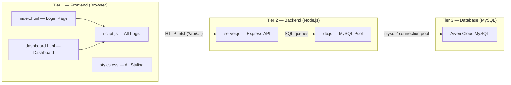
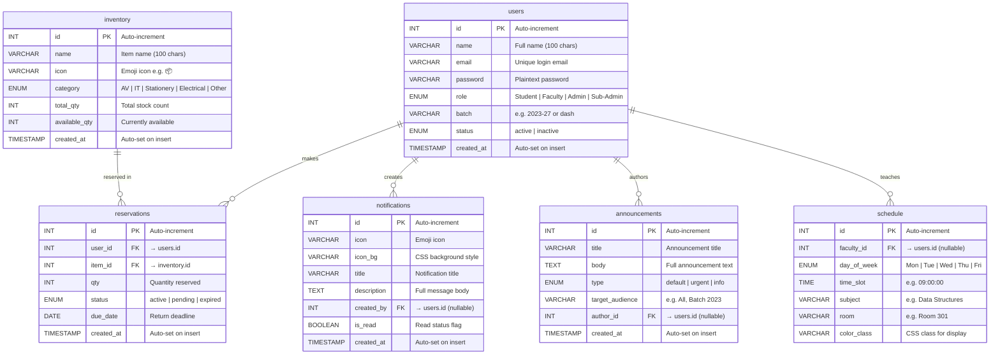
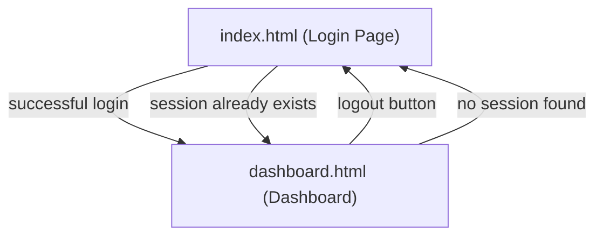
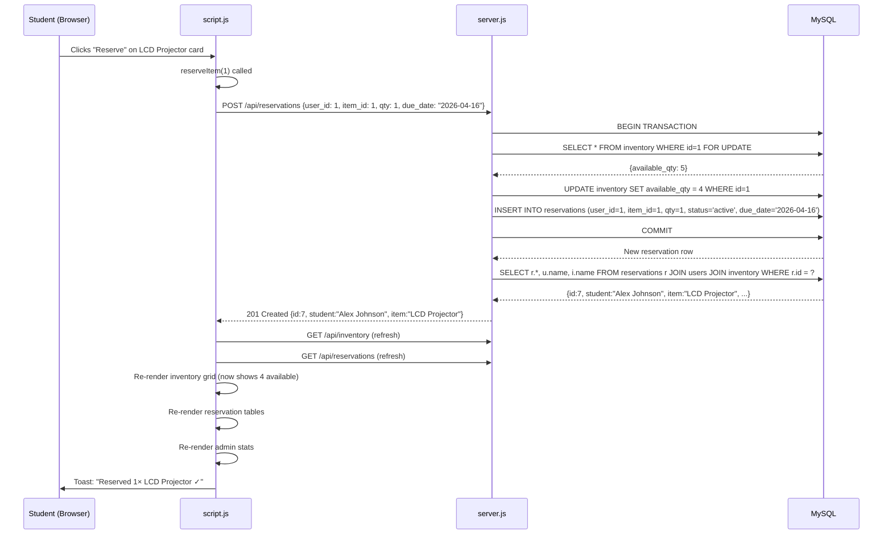
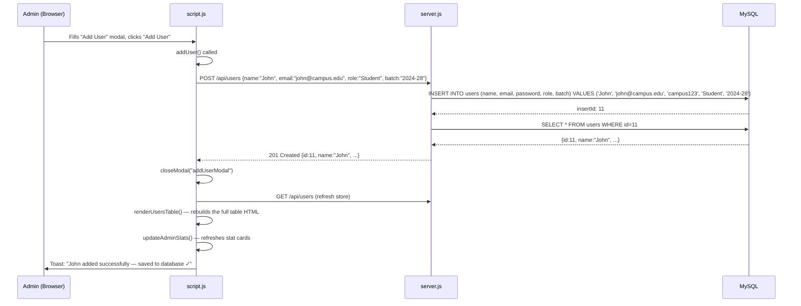
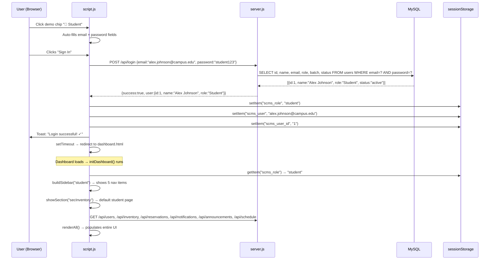

# SCMS — Complete System Walkthrough

> A detailed explanation of **every part** of the SmartCampus Management System: how the database is structured, how the server works, how the frontend talks to the server, and how everything connects.

---

## 1. High-Level Architecture

The app follows a classic **3-tier architecture**:



| Layer | Technology | Files |
|-------|-----------|-------|
| Frontend | Vanilla HTML + CSS + JS | `index.html`, `dashboard.html`, `styles.css`, `script.js` |
| Backend | Node.js + Express 5 | `server/server.js`, `server/db.js` |
| Database | MySQL (Aiven Cloud) | `database/schema.sql` |
| Config | dotenv | `.env` |

---

## 2. The Database — Everything That's Stored

The database is named `defaultdb` (on Aiven Cloud) and contains **6 tables**. Here's every table, every column, and what it does:

### 2.1 Entity-Relationship Diagram



### 2.2 Table-by-Table Breakdown

---

#### `users` — The People

This is the **central table**. Almost every other table references it.

| Column | Type | Purpose |
|--------|------|---------|
| `id` | `INT AUTO_INCREMENT PK` | Unique identifier for every user |
| `name` | `VARCHAR(100)` | Display name (e.g. "Alex Johnson") |
| `email` | `VARCHAR(100) UNIQUE` | Login email — must be unique across all users |
| `password` | `VARCHAR(255)` | Stored as plaintext (default: `campus123`) |
| `role` | `ENUM('Student','Faculty','Admin','Sub-Admin')` | Determines what dashboard they see and what they can do |
| `batch` | `VARCHAR(20)` | Student batch year (e.g. "2023-27"), dash for non-students |
| `status` | `ENUM('active','inactive')` | Inactive users cannot log in |
| `created_at` | `TIMESTAMP` | Auto-set when the row is inserted |

**Seed data:** 10 users (6 students, 2 faculty, 1 admin, 1 CR/sub-admin)

---

#### `inventory` — Campus Items

Tracks every physical item that can be reserved.

| Column | Type | Purpose |
|--------|------|---------|
| `id` | `INT AUTO_INCREMENT PK` | Unique item ID |
| `name` | `VARCHAR(100)` | Item name (e.g. "LCD Projector") |
| `icon` | `VARCHAR(10)` | Emoji displayed in the UI (e.g. 📽️) |
| `category` | `ENUM('AV','IT','Stationery','Electrical','Other')` | Classification for filtering |
| `total_qty` | `INT` | How many exist in total |
| `available_qty` | `INT` | How many are currently available (decreases on reservation, increases on cancellation) |
| `created_at` | `TIMESTAMP` | Auto-set on insert |

**Key relationship:** `available_qty` is **modified transactionally** when reservations are created or cancelled.

**Seed data:** 12 items across all categories

---

#### `reservations` — Who Has What

Links a **user** to an **inventory item** they've reserved.

| Column | Type | Purpose |
|--------|------|---------|
| `id` | `INT AUTO_INCREMENT PK` | Unique reservation ID |
| `user_id` | `INT FK → users.id` | Who reserved it |
| `item_id` | `INT FK → inventory.id` | What was reserved |
| `qty` | `INT` | How many units |
| `status` | `ENUM('active','pending','expired')` | Lifecycle state |
| `due_date` | `DATE` | When it must be returned |
| `created_at` | `TIMESTAMP` | When the reservation was made |

**Foreign Keys:**
- `user_id → users(id) ON DELETE CASCADE` — if a user is deleted, their reservations are auto-deleted
- `item_id → inventory(id) ON DELETE CASCADE` — if an item is deleted, its reservations are auto-deleted

**Seed data:** 6 reservations in various states

---

#### `notifications` — System Messages

Global notifications visible to all users.

| Column | Type | Purpose |
|--------|------|---------|
| `id` | `INT AUTO_INCREMENT PK` | Unique notification ID |
| `icon` | `VARCHAR(10)` | Emoji icon (🔔, 📦, etc.) |
| `icon_bg` | `VARCHAR(100)` | CSS style string for icon background |
| `title` | `VARCHAR(200)` | Short notification headline |
| `description` | `TEXT` | Full message body |
| `created_by` | `INT FK → users.id` | Who sent it (nullable) |
| `is_read` | `BOOLEAN` | Whether it's been read (affects bell badge) |
| `created_at` | `TIMESTAMP` | When it was created |

**Foreign Key:** `created_by → users(id) ON DELETE SET NULL` — if the sender is deleted, the notification survives but the author becomes NULL

---

#### `announcements` — Campus-Wide Posts

Announcements posted by admins or CRs.

| Column | Type | Purpose |
|--------|------|---------|
| `id` | `INT AUTO_INCREMENT PK` | Unique announcement ID |
| `title` | `VARCHAR(200)` | Announcement headline |
| `body` | `TEXT` | Full text content |
| `type` | `ENUM('default','urgent','info')` | Determines visual styling (red border for urgent, blue for info) |
| `target_audience` | `VARCHAR(100)` | Who it's for (e.g. "All Students", "Batch 2023") |
| `author_id` | `INT FK → users.id` | Who posted it (nullable) |
| `created_at` | `TIMESTAMP` | When it was posted |

**Foreign Key:** `author_id → users(id) ON DELETE SET NULL`

---

#### `schedule` — Faculty Timetable

Weekly teaching schedule displayed in a grid.

| Column | Type | Purpose |
|--------|------|---------|
| `id` | `INT AUTO_INCREMENT PK` | Unique entry ID |
| `faculty_id` | `INT FK → users.id` | Which faculty member |
| `day_of_week` | `ENUM('Mon','Tue','Wed','Thu','Fri')` | Day of the week |
| `time_slot` | `TIME` | Class start time (e.g. 09:00:00) |
| `subject` | `VARCHAR(100)` | Course name |
| `room` | `VARCHAR(50)` | Room/lab identifier |
| `color_class` | `VARCHAR(30)` | CSS class for visual color coding |

**Foreign Key:** `faculty_id → users(id) ON DELETE SET NULL`

---

### 2.3 Foreign Key Summary

All the relationships between tables at a glance:

```
reservations.user_id  → users.id       (ON DELETE CASCADE)
reservations.item_id  → inventory.id   (ON DELETE CASCADE)
notifications.created_by → users.id    (ON DELETE SET NULL)
announcements.author_id  → users.id   (ON DELETE SET NULL)
schedule.faculty_id       → users.id   (ON DELETE SET NULL)
```

> [!IMPORTANT]
> **CASCADE vs SET NULL:** Reservations are deleted when the associated user or item is deleted (because they become meaningless). But notifications, announcements, and schedule entries are preserved (SET NULL) so historical records aren't lost.

---

## 3. The Backend Server — How the API Works

### 3.1 Database Connection ([db.js](file:///c:/Saintgits/Semester%204/dbms%20project/server/db.js))

This file creates a **MySQL connection pool** using `mysql2/promise`:

```
.env file → db.js reads the config → creates a pool of 10 connections → exports the pool
```

- Uses environment variables from `.env` for host, port, user, password, database name
- Auto-detects if it's connecting to Aiven Cloud and enables SSL
- Connection pool means the server reuses connections instead of opening a new one for every query (much faster)

### 3.2 Server Setup ([server.js](file:///c:/Saintgits/Semester%204/dbms%20project/server/server.js))

Express server on port 3000 with 3 middleware layers:

1. **CORS** — allows the frontend to make API calls from any origin
2. **body-parser** — parses JSON request bodies
3. **express.static** — serves the frontend files (HTML, CSS, JS) from the parent directory

### 3.3 Every API Endpoint

Here's every route the server exposes, what SQL it runs, and what it returns:

---

#### Authentication

| Method | Endpoint | What it does | SQL |
|--------|----------|-------------|-----|
| `POST` | `/api/login` | Verifies email + password, checks if account is active | `SELECT ... FROM users WHERE email = ? AND password = ?` |

**Flow:** Receives `{email, password}` → queries users table → if found and active → returns `{success: true, user: {...}}` → if inactive → returns 403 → if not found → returns 401

---

#### Users CRUD

| Method | Endpoint | What it does | SQL |
|--------|----------|-------------|-----|
| `GET` | `/api/users` | List all users | `SELECT ... FROM users ORDER BY id` |
| `GET` | `/api/users/:id` | Get one user | `SELECT ... FROM users WHERE id = ?` |
| `POST` | `/api/users` | Create new user (signup) | `INSERT INTO users (name, email, password, role, batch) VALUES (?,?,?,?,?)` |
| `PUT` | `/api/users/:id` | Edit user | `UPDATE users SET name=?, email=?, role=?, batch=?, status=? WHERE id=?` |
| `PUT` | `/api/users/:id/promote` | Promote role up one level | Reads current role → bumps to next in chain: Student → Sub-Admin → Faculty → Admin |
| `DELETE` | `/api/users/:id` | Delete user | `DELETE FROM users WHERE id = ?` (cascades to reservations) |

---

#### Inventory CRUD

| Method | Endpoint | What it does | SQL |
|--------|----------|-------------|-----|
| `GET` | `/api/inventory` | List all items (optional `?category=` filter) | `SELECT * FROM inventory` or `WHERE category = ?` |
| `POST` | `/api/inventory` | Add new item | `INSERT INTO inventory (...) VALUES (...)` — sets `available_qty = total_qty` |
| `PUT` | `/api/inventory/:id` | Edit item | `UPDATE inventory SET ... WHERE id = ?` |
| `DELETE` | `/api/inventory/:id` | Remove item | `DELETE FROM inventory WHERE id = ?` (cascades to reservations) |

---

#### Reservations

| Method | Endpoint | What it does | SQL |
|--------|----------|-------------|-----|
| `GET` | `/api/reservations` | List all with user + item names | `JOIN` across 3 tables |
| `GET` | `/api/reservations/user/:userId` | Reservations for one user | Same join, filtered by `user_id` |
| `POST` | `/api/reservations` | Create reservation (transactional) | See below |
| `PUT` | `/api/reservations/:id/cancel` | Cancel reservation (transactional) | See below |

> [!IMPORTANT]
> **The reservation create/cancel endpoints use database transactions** — this is the most complex part of the server. Here's exactly what happens:

**Creating a reservation (`POST /api/reservations`):**
```
1. BEGIN TRANSACTION
2. SELECT * FROM inventory WHERE id = ? FOR UPDATE   ← locks the row
3. Check: is available_qty >= requested qty?
   - NO  → ROLLBACK, return "Not enough stock"
   - YES → continue
4. UPDATE inventory SET available_qty = available_qty - ? WHERE id = ?
5. INSERT INTO reservations (user_id, item_id, qty, status, due_date) VALUES (...)
6. COMMIT
7. Return the new reservation with JOINed user + item names
```

**Cancelling a reservation (`PUT /api/reservations/:id/cancel`):**
```
1. BEGIN TRANSACTION
2. SELECT * FROM reservations WHERE id = ?
3. Check: is status already 'expired'?
   - YES → ROLLBACK, return error
   - NO  → continue
4. UPDATE reservations SET status = 'expired' WHERE id = ?
5. UPDATE inventory SET available_qty = available_qty + ? WHERE id = ?  ← return stock
6. COMMIT
7. Return the updated reservation
```

The `FOR UPDATE` lock in step 2 of creation prevents two people from reserving the last item simultaneously (a race condition).

---

#### Notifications

| Method | Endpoint | What it does |
|--------|----------|-------------|
| `GET` | `/api/notifications` | List all, newest first |
| `POST` | `/api/notifications` | Create new notification |
| `PUT` | `/api/notifications/:id/read` | Mark one as read |
| `PUT` | `/api/notifications/read-all` | Mark ALL as read |

---

#### Announcements

| Method | Endpoint | What it does | SQL |
|--------|----------|-------------|-----|
| `GET` | `/api/announcements` | List all with author name | `LEFT JOIN users` on `author_id` |
| `POST` | `/api/announcements` | Create new announcement | `INSERT INTO announcements (...)` |

---

#### Schedule

| Method | Endpoint | What it does | SQL |
|--------|----------|-------------|-----|
| `GET` | `/api/schedule` | Full weekly schedule with faculty names | `LEFT JOIN users`, ordered by `FIELD(day_of_week, 'Mon','Tue',...), time_slot` |
| `POST` | `/api/schedule` | Add a new schedule entry | `INSERT INTO schedule (...)` |

---

#### Dashboard Stats

| Method | Endpoint | What it returns |
|--------|----------|----------------|
| `GET` | `/api/stats/admin` | Total users, items, available stock, active/pending reservations, announcements count |
| `GET` | `/api/stats/faculty` | Student count, today's classes, unread notifications |
| `GET` | `/api/stats/cr` | Announcement count, notification count, available items |

---

## 4. The Frontend — How the UI Works

### 4.1 Two-Page Architecture

The app has exactly **two HTML pages**:



Both pages share the same `script.js` and `styles.css`. On page load, the script detects which page it's on:

```javascript
if (document.getElementById("loginPage"))  → initLogin()
if (document.getElementById("appShell"))   → initDashboard()
```

### 4.2 Session Management

The app uses **`sessionStorage`** (browser memory, cleared when tab closes) to track who's logged in:

| Key | Value | Example |
|-----|-------|---------|
| `scms_role` | Lowercase role string | `"student"`, `"admin"`, `"faculty"`, `"subadmin"` |
| `scms_user` | User's email | `"alex.johnson@campus.edu"` |
| `scms_user_id` | User's database ID | `"1"` |

**Login flow:**
```
1. User fills email + password on index.html
2. script.js sends POST /api/login with {email, password}
3. Server checks users table → returns user object
4. script.js saves role, email, id to sessionStorage
5. Redirects to dashboard.html
```

**Dashboard load flow:**
```
1. dashboard.html loads → script.js checks sessionStorage
2. No session? → redirect to index.html
3. Has session? → read role → build correct sidebar → load all data from API → render
```

**Logout:**
```
1. Clears all 3 sessionStorage keys
2. Redirects to index.html
```

### 4.3 The Local Store — Client-Side Cache

All data from the database is cached in a JavaScript object called `store`:

```javascript
const store = {
  users: [],          // ← from GET /api/users
  inventory: [],      // ← from GET /api/inventory
  reservations: [],   // ← from GET /api/reservations
  notifications: [],  // ← from GET /api/notifications
  announcements: [],  // ← from GET /api/announcements
  scheduleData: {},   // ← from GET /api/schedule (restructured)
  session: { role, user, userId }
};
```

On dashboard load, **all 6 loaders run in parallel** via `Promise.all`:

```javascript
await Promise.all([
  loadUsers(),          // fetch('/api/users')        → store.users
  loadInventory(),      // fetch('/api/inventory')    → store.inventory
  loadReservations(),   // fetch('/api/reservations') → store.reservations
  loadNotifications(),  // fetch('/api/notifications')→ store.notifications
  loadAnnouncements(),  // fetch('/api/announcements')→ store.announcements
  loadSchedule(),       // fetch('/api/schedule')     → store.scheduleData
]);
```

After loading, `renderAll()` is called which populates every UI element.

### 4.4 Role-Based Access Control (RBAC)

Each role sees a completely different dashboard. The sidebar nav is built dynamically based on role:

````carousel
### 🎒 Student
| Nav Item | Section | What they see |
|----------|---------|---------------|
| Inventory | `secInventory` | Browse items, reserve them |
| Notifications | `secNotifications` | View notifications |
| Faculty Schedule | `secSchedule` | Weekly timetable grid |
| My Reservations | `secMyReservations` | Their own reservations, can cancel |
| Announcements | `secAnnouncements` | Read announcements |
<!-- slide -->
### 🛡️ Admin
| Nav Item | Section | What they see |
|----------|---------|---------------|
| Overview | `secAdminOverview` | Stats, recent reservations, quick actions |
| Manage Users | `secManageUsers` | Full CRUD on users (add/edit/promote/delete) |
| Inventory | `secAdminInventory` | Full CRUD on items (add/edit/delete) |
| Reservations | `secAdminReservations` | All reservations, can cancel any |
| Notifications | `secAdminNotifs` | View + send notifications |
<!-- slide -->
### 👨‍🏫 Faculty
| Nav Item | Section | What they see |
|----------|---------|---------------|
| Overview | `secFacOverview` | Stats + today's schedule |
| My Schedule | `secFacSchedule` | Full weekly grid + upload new entries |
| Assigned Students | `secFacStudents` | List of all students |
| Notifications | `secFacNotifs` | View notifications |
<!-- slide -->
### 📋 CR (Sub-Admin)
| Nav Item | Section | What they see |
|----------|---------|---------------|
| Overview | `secCROverview` | Stats cards |
| Announcements | `secCRAnnounce` | View + post announcements |
| Send Notifications | `secCRNotif` | View + send notifications |
| Browse Inventory | `secCRInventory` | Browse items + reserve |
````

The sidebar is built by [buildSidebar(role)](file:///c:/Saintgits/Semester%204/dbms%20project/script.js#L271-L292) using configurations defined in `navConfig`.

### 4.5 How User Actions Flow (End-to-End Examples)

---

#### Example 1: Student Reserves an Item



---

#### Example 2: Admin Adds a New User



---

#### Example 3: Login Flow



---

## 5. The API Helper — How Frontend Talks to Backend

Every API call from the frontend goes through one helper function:

```javascript
async function api(endpoint, method = 'GET', body = null) {
  const res = await fetch(`/api${endpoint}`, {
    method,
    headers: { 'Content-Type': 'application/json' },
    body: body ? JSON.stringify(body) : undefined
  });
  const data = await res.json();
  if (!res.ok) throw new Error(data.error || 'API request failed');
  return data;
}
```

The key design decision: **`API = '/api'` (relative path)**. Because `server.js` serves the frontend files via `express.static`, both the HTML pages and the API live on the same domain (`localhost:3000`). So `fetch('/api/users')` resolves to `http://localhost:3000/api/users`.

---

## 6. The UI Components

### 6.1 Toast System
Pop-up messages that appear in the bottom-right corner. Used for feedback on every action (success, error, info). Auto-dismiss after 3 seconds with a fade-out animation.

### 6.2 Modal System
Overlay dialogs for forms (Add User, Edit Item, Post Announcement, etc.). Opened by adding CSS class `"open"`, closed by removing it. Can be dismissed by clicking the backdrop.

### 6.3 Schedule Grid
A Mon-Fri × 8:00-16:00 grid built from `store.scheduleData`. Each cell checks if an event exists for that day+time slot and renders a colored card.

### 6.4 Inventory Grid
Card-based layout with progress bars showing available vs total quantity. Color-coded: green (>50%), amber (25-50%), red (<25%).

### 6.5 Notification Bell
Bell icon in topbar with a red dot badge for unread count. Click opens a dropdown popup with all notifications. Each can be clicked to mark as read.

---

## 7. File-by-File Summary

| File | Size | Purpose |
|------|------|---------|
| [index.html](file:///c:/Saintgits/Semester%204/dbms%20project/index.html) | 4 KB | Login page — role tabs, email/password form, sign up toggle, demo chips |
| [dashboard.html](file:///c:/Saintgits/Semester%204/dbms%20project/dashboard.html) | 26 KB | Dashboard — sidebar, topbar, 15+ sections (hidden/shown by JS), 6 modals |
| [script.js](file:///c:/Saintgits/Semester%204/dbms%20project/script.js) | 50 KB | ALL application logic — API calls, rendering, state management, event handlers |
| [styles.css](file:///c:/Saintgits/Semester%204/dbms%20project/styles.css) | 31 KB | ALL styling — design system, layout, components, animations, responsive |
| [server.js](file:///c:/Saintgits/Semester%204/dbms%20project/server/server.js) | 23 KB | Express API — 20+ REST endpoints, all SQL queries |
| [db.js](file:///c:/Saintgits/Semester%204/dbms%20project/server/db.js) | 1 KB | MySQL connection pool setup |
| [schema.sql](file:///c:/Saintgits/Semester%204/dbms%20project/database/schema.sql) | 9 KB | Table definitions + seed data for all 6 tables |
| [.env](file:///c:/Saintgits/Semester%204/dbms%20project/.env) | 146 B | Database credentials (Aiven Cloud host, port, user, password) |
| [package.json](file:///c:/Saintgits/Semester%204/dbms%20project/package.json) | 399 B | Dependencies: express, mysql2, cors, body-parser, dotenv |

---

## 8. How to Run It

```bash
# 1. Install dependencies
npm install

# 2. Start the server
node server/server.js

# 3. Open in browser
# → http://localhost:3000        (login page)
# → http://localhost:3000/dashboard.html  (dashboard, if logged in)
```

The server serves both the API and the frontend files, so there's no separate frontend dev server.
